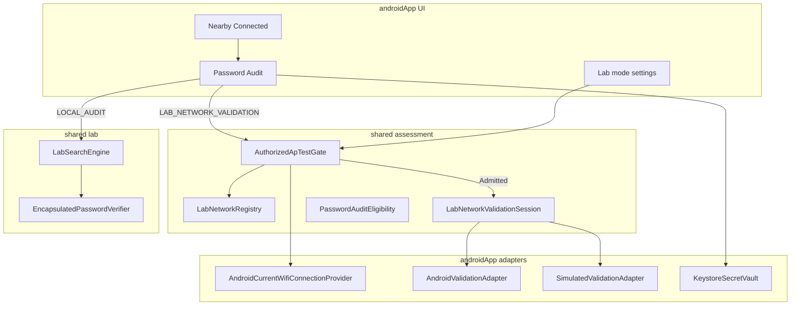

# 14 · Plan técnico — LOCAL_AUDIT + LAB_NETWORK_VALIDATION

- Fecha: 2026-10-03
- Rama de fundación: `feature/authorized-ap-lab-foundation`
- ADR base: [ADR-004-authorized-ap-lab-test](./adr/ADR-004-authorized-ap-lab-test.md)
- Relacionado: ADR-003, ADR-connected-known-password-audit, 0006, 0007, docs/04–07, 13-walkthrough

## Nomenclatura

| Nombre de producto | Nombre en código | Rol |
| --- | --- | --- |
| **LOCAL_AUDIT** | `VerificationMode.LOCAL_AUDIT` | Auditoría 100 % local; no habla con el AP |
| **LAB_NETWORK_VALIDATION** | `VerificationMode.LAB_NETWORK_VALIDATION` | Validación acotada contra la red **actual**, solo laboratorio autorizado |

La capa de adaptadores es **`NetworkValidationAdapter`** (`SimulatedValidationAdapter`,
`AndroidValidationAdapter`). Alias ADR: `PlatformApAuthProbe`.
Gate central: `AuthorizedApTestGate` (alias `LabValidationPolicy`).
Registry: `AuthorizedLabNetworkStore` (alias `LabNetworkRegistry`).

---

## 1. Estado actual esperado

### Ya implementado (producto / Code+CI)

| Capacidad | Estado | Ubicación |
| --- | --- | --- |
| Escaneo Nearby + matching Vault | Implemented | `:shared:assessment` + `AndroidWifiScanner` |
| Detección conexión actual + badge Conectado | Implemented | `CurrentWifiConnectionProvider` |
| Elegibilidad audit (PSK/WEP personal + conectado) | Implemented | `PasswordAuditEligibilityChecker` |
| **LOCAL_AUDIT** end-to-end | Implemented | `PasswordAuditViewModel` + `LabSearchEngine` + `EncapsulatedPasswordVerifier` |
| Planner auth-aware (PSK/WEP) + Lab sintético | Implemented | `:shared:lab` |
| Vault propio (Keystore AEAD + SQLDelight metadatos) | Implemented | `KeystoreSecretVault`, `SavedNetworkRepository` |
| Vault/Nearby → Lab seed (LAB-05/06) | Implemented | `LabNetworkContext`, seed one-shot |
| Frontera Gradle lab ↛ assessment | Implemented | ADR-003 |

### Fundación F0 — **DONE** (rama `feature/authorized-ap-lab-foundation`)

| Pieza | Estado |
| --- | --- |
| ADR-004 + plan §15 F0 | **Implemented** |
| `VerificationMode` LOCAL / LAB_NETWORK_VALIDATION | **Implemented** |
| `labModeEnabled` (Ajustes, default false) | **Implemented** |
| `AuthorizedApTestGate` + `LabModeDisabled` | **Implemented** |
| `AuthorizedLabNetworkStore` / registry | **Implemented** |
| Consentimiento de sesión (no global eterno) | **Implemented** |
| `NetworkValidationAdapter` + `AndroidValidationAdapter` = Unavailable | **Implemented** (fail-closed) |
| UI Audit: selector + denegaciones tipadas | **Implemented** |
| Arranque LAB bloqueado en F0 | **Implemented** |
| `AuthorizedApTestSession` / probe Android activo | **Planned F1** |
| Rate-limit / session log persistido | **Planned F1** |

### Interpretación del requisito «sacar contraseña»

El producto **no** recupera la PSK del almacén Wi‑Fi de Android en builds
estándar (limitación de plataforma, §2–3). «Probar algoritmos sobre redes propias»
= **LOCAL_AUDIT** (fortaleza / diccionarios / patrones / motor) +, cuando la
plataforma lo permita de forma controlada, **LAB_NETWORK_VALIDATION** (pocos
intentos acotados contra el AP **actual**, con gate fail-closed).

---

## 2. Capacidades reales de Android (clasificación)

Leyenda:

| Categoría | Significado |
| --- | --- |
| **STANDARD_ANDROID** | App normal (Play / sideload sin privilegios de firma) |
| **MANAGED_DEVICE** | Device Owner / Profile Owner / Android Enterprise |
| **PRIVILEGED_SYSTEM** | App de sistema / firma de plataforma / `@SystemApi` |
| **LAB_DEVICE_ONLY** | Imagen AOSP / dispositivo de investigación con privilegios o root |
| **NOT_AVAILABLE** | No existe API pública estable para el caso de uso |

### Lectura de entorno / red actual

| Capacidad | Categoría | Notas |
| --- | --- | --- |
| `WifiManager.startScan` + `ScanResult` (SSID, BSSID, freq, level, capabilities) | STANDARD_ANDROID | Permisos: ≤12 ubicación; 13+ `NEARBY_WIFI_DEVICES` (`neverForLocation`) |
| Throttle de escaneo | STANDARD_ANDROID | Documentado; UI debe tolerar `THROTTLED` |
| SSID/BSSID de conexión (`WifiInfo` / APIs Connectivity) | STANDARD_ANDROID | Permisos de inspección; SSID puede venir `"<unknown ssid>"` sin permiso |
| Familia de seguridad desde scan capabilities | STANDARD_ANDROID | Via `WifiSecurityClassifier` |
| Escuchar cambios de red (`ConnectivityManager` / callbacks) | STANDARD_ANDROID | Base del STOP si cambia conexión |
| `WifiManager.isStaConcurrencyForLocalOnlyConnectionsSupported()` | STANDARD_ANDROID (API 31+) | Indica si cabe request local-only concurrente |

### Credenciales Wi‑Fi del sistema

| Capacidad | Categoría | Notas |
| --- | --- | --- |
| Leer `preSharedKey` real de redes guardadas del usuario | **NOT_AVAILABLE** (app normal) | Deliberado desde Android 10: `getConfiguredNetworks()` vacío o PSK enmascarada (`"*"`) para apps que targetean Q+ |
| `getConfiguredNetworks()` lista completa | MANAGED_DEVICE / PRIVILEGED_SYSTEM | Exenciones DO/PO/system; no implica PSK en claro en todos los caminos |
| `getPrivilegedConfiguredNetworks()` con PSK | **PRIVILEGED_SYSTEM** | `@SystemApi`; requiere `READ_WIFI_CREDENTIAL` (+ ubicación/Wi‑Fi). **No** en Play |
| Leer PSK de red que el DO creó | MANAGED_DEVICE (parcial) | Mejor práctica: **registrar PSK al dar de alta** (Vault), no depender de lectura posterior |
| Root / ficheros supplicant | **LAB_DEVICE_ONLY** | Fuera de variante Play; fail-closed por defecto |

**Diseño principal de credenciales:** Vault propio de la app (ya implementado).
Documentar la limitación; no inventar APIs de bypass.

### Operaciones de conexión / sugerencia

| Capacidad | Categoría | Interacción usuario |
| --- | --- | --- |
| `WifiNetworkSpecifier` + `ConnectivityManager.requestNetwork` (API 29+) | STANDARD_ANDROID | Diálogo de sistema frecuente; aprobación puede recordarse para SSID+BSSID exactos |
| `WifiNetworkSuggestion` / `addNetworkSuggestions` | STANDARD_ANDROID | Notificación/diálogo de aprobación; no es «saved network» clásico |
| `ACTION_WIFI_ADD_NETWORKS` (API 30+) | STANDARD_ANDROID | Activity de sistema para que el usuario apruebe añadir red |
| `enableNetwork` / `addNetwork` / `setWifiEnabled` (legacy) | NOT_AVAILABLE para target Q+ (app normal) | Exenciones DO/PO/system |
| EAPOL / handshake / PMKID / deauth silenciosos | **NOT_AVAILABLE** | No hay API pública para apps normales |
| Verificación masiva de passphrases sin UI | **NOT_AVAILABLE** | Implica que LAB_NETWORK_VALIDATION **no** puede reutilizar el bucle V2 a millones intentos/s |

### Implicación

LAB_NETWORK_VALIDATION = orquestador de **bajo presupuesto** +
`NetworkValidationAdapter` (p. ej. un `requestNetwork` con passphrase conocida),
nunca `CandidateVerifier` del `LabSearchEngine` paralelo.

---

## 3. Limitaciones por versión / API

| API level | Efecto relevante |
| --- | --- |
| ≤ 28 | Más APIs legacy de configuración; producto mínimo actual = API 29+ (emuladores CI 29/35) |
| **29 (Q)** | `WifiNetworkSpecifier` / suggestions; `getConfiguredNetworks` vacío para apps normales target Q+; no toggle Wi‑Fi |
| **30 (R)** | `ACTION_WIFI_ADD_NETWORKS`; diálogo suggestions en foreground |
| **31 (S)** | Concurrencia STA local-only documentada; band en specifier |
| **33 (T)** | `NEARBY_WIFI_DEVICES`; DO puede restringir cambio de Wi‑Fi |
| **34–35** | Endurecimiento privacidad SSID/BSSID; mismos contratos públicos |

Cada limitación **no se elimina** del alcance: se clasifica y se elige adaptador
(`Simulated` / `Android` / `InstrumentedLab` / futuro `Privileged`).

---

## 4. Modelo de dominio

### Agregados / conceptos

```text
WifiEnvironment          // snapshot: conexión actual + (opcional) observación Nearby
WifiConnectionIdentity   // SSID + BSSID? + SecurityFamily
LabNetworkRegistry       // redes marcadas lab (hoy: AuthorizedLabNetworkStore)
CredentialVault          // SecretVault + SavedNetwork metadatos (sin ser selector de target)
AuditEngine              // LabSearchEngine + planners (solo LOCAL_AUDIT)
NetworkValidationAdapter // sondeo AP acotado (LAB_NETWORK_VALIDATION)
AuditSession             // sesión activa (local o lab validation)
AuditPolicy              // presupuestos, rate-limit, cancelación, retención de logs
VerificationMode         // LOCAL_AUDIT | LAB_NETWORK_VALIDATION
```

### Gate fail-closed (producto)

```text
admit LabNetworkValidation iff
  labModeEnabled
  AND verificationMode == LAB_NETWORK_VALIDATION
  AND currentNetwork matches targetIdentity   // Exact | Probable
  AND registeredLabNetwork(targetIdentity)
  AND explicitUserConsent (este arranque)
  AND adapter.capability == Available
  AND family.supportsSharedPasswordAudit()
  AND withinRateLimit / sessionBudget
```

Si falla cualquiera → **Denied**; no arranca. No hay campo UI de SSID/BSSID libre
como objetivo.

### Target vs credencial

| Origen | Puede fijar **target** | Puede aportar **credencial/candidato** |
| --- | --- | --- |
| Conexión Wi‑Fi actual | **Sí (única fuente)** | No |
| Nearby observación (misma red conectada) | Contexto / match | No |
| Vault | **No** | Sí (reveal diferido) |
| Entrada manual | **No** (como target) | Sí |

---

## 5. Interfaces y adaptadores

Mantener ADR-003: `:shared:lab` sin Android ni assessment.

### Propuesta de puertos (assessment / application)

```kotlin
// Nombres de producto; mapear a tipos existentes donde aplique.

interface WifiConnectionProvider { /* = CurrentWifiConnectionProvider */ }

interface LabNetworkRegistry {
    suspend fun isRegistered(key: AuthorizedLabNetworkKey): Boolean
    suspend fun setRegistered(key: AuthorizedLabNetworkKey, registered: Boolean)
    suspend fun registeredKeys(): Set<AuthorizedLabNetworkKey>
}

interface CredentialVault { /* = SecretVault + casos de uso Vault */ }

interface NetworkValidationAdapter {
    suspend fun capability(): ApAuthCapability
    suspend fun validateOnce(request: ApAuthProbeRequest): ApAuthProbeResult
}

interface AuditSessionLog {
    suspend fun append(entry: AuditSessionRecord) // sin secretos
    suspend fun recent(): List<AuditSessionRecord>
}

interface LabModeSettings {
    suspend fun isLabModeEnabled(): Boolean
    suspend fun setLabModeEnabled(enabled: Boolean)
}
```

### Árbol de adaptadores

```text
NetworkValidationAdapter
├── SimulatedValidationAdapter     // unit tests / CI JVM: Accepted/Rejected determinista
├── AndroidValidationAdapter       // WifiNetworkSpecifier + requestNetwork (API 29+)
│                                 // capability puede ser Unavailable(PlatformApiLimitation)
│                                 // hasta evidencia en lab device
└── InstrumentedLabAdapter         // androidTest / device lab: fakes + reglas de timing
```

Futuro opcional (nunca en flavor Play):

```text
└── PrivilegedCredentialReader     // getPrivilegedConfiguredNetworks — PRIVILEGED_SYSTEM
```

**Regla:** `NetworkValidationAdapter` ≠ `CandidateVerifier` del motor V2.

### Orquestador

`LabNetworkValidationSession` (código ADR: `AuthorizedApTestSession`):

1. Re-evalúa gate.
2. Resuelve candidato (Vault diferido o manual) **sin loguearlo**.
3. Llama `validateOnce` con rate-limit (p. ej. 1 intento / N segundos; presupuesto
   de sesión 1–K intentos, K pequeño).
4. Observa conexión; si cambia → `Aborted(ConnectionChanged)`.
5. Emite resultado + `AuditSessionRecord` (metadatos).

---

## 6. Flujo de UI

```text
Cercanas
  → red con badge Conectado (PSK/WEP elegible)
  → Auditar
  → Selector: LOCAL_AUDIT | LAB_NETWORK_VALIDATION
       ├─ LOCAL_AUDIT
       │    → Vault diferido / manual
       │    → plan automático + presupuesto
       │    → INICIAR → motor local → informe
       └─ LAB_NETWORK_VALIDATION
            → requiere labModeEnabled (Ajustes)
            → checkbox «Red de laboratorio registrada» (si no, CTA a registrar)
            → consentimiento explícito (checkbox este arranque)
            → mostrar capability del adapter (Available / motivo Unavailable)
            → INICIAR → gate → sesión acotada → resultado Accepted/Rejected/Unavailable
```

**Vault:**

- No selecciona el objetivo de red.
- Puede abrir **LOCAL_AUDIT** con credencial (como hoy) **sin** LAB_NETWORK_VALIDATION
  salvo que la conexión actual coincida y el usuario entre por Cercanas.
- Marcar «red de laboratorio» es metadato de identidad (SSID+familia), no target.

**Sin** campo de SSID/BSSID objetivo editable en Audit.

---

## 7. Modelo de permisos

| Permiso / condición | Para qué |
| --- | --- |
| `NEARBY_WIFI_DEVICES` (33+) / `ACCESS_FINE_LOCATION` (≤32) | Escaneo + a menudo lectura SSID conexión |
| Servicios de ubicación activos (≤32 típico) | Escaneo fiable |
| `ACCESS_WIFI_STATE` / `CHANGE_WIFI_STATE` (según API) | Suggestions / requests (CHANGE puede revocarse si el usuario deniega suggestion) |
| Consentimiento **in-app** lab | Gate LAB_NETWORK_VALIDATION |
| Diálogo sistema `requestNetwork` | Interacción de plataforma; no sustituye consentimiento in-app |

Permission Center existente debe explicar: escaneo ≠ lectura de PSK del sistema.

---

## 8. Almacenamiento seguro de credenciales (Vault)

Estado actual + endurecimientos planificados:

| Tema | Diseño |
| --- | --- |
| Keystore | AES-GCM; clave en Android Keystore (`KeystoreSecretVault`) |
| Ciphertext en reposo | SharedPreferences privadas (Base64 IV+tag+data); valorar EncryptedSharedPreferences / archivo dedicado en F2 |
| Separación | Metadatos red (SQLDelight) ↔ `secretId` ↔ ciphertext |
| Política de acceso | Reveal explícito; diferido en Audit; no logs/`toString` |
| Borrado | `DeleteSavedNetwork` metadatos → secreto (ADR 0007) |
| Migraciones | Versionar esquema SQLDelight + versión de blob de secreto |
| Backups | Excluir prefs de secretos de backup automático (`android:allowBackup` / `backupRules`) — **auditoría F1** |
| Lab registry | Prefs separadas (`AuthorizedLabNetworkStore`); **sin** secretos |

Vault **solo** almacena secretos introducidos voluntariamente en la app.

---

## 9. Política de redes LAB

| Regla | Detalle |
| --- | --- |
| Registro explícito | Usuario marca SSID+familia como lab (`LabNetworkRegistry`) |
| `labModeEnabled` | Flag global en Ajustes; OFF por defecto |
| Objetivo | Solo conexión actual ∩ registro |
| Consentimiento | Por sesión de arranque |
| Rate-limit | Persistido (p. ej. máx. N validaciones / hora) |
| Duración | Timeout por `validateOnce` + presupuesto de sesión |
| Cancelación | STOP usuario + auto si cambia conexión |
| Registro | `AuditSessionRecord` sin passphrase |
| Prohibido | SSID/BSSID arbitrario como target; lanzar desde lista Nearby no conectada |

Fórmula operativa (= gate + settings):

```text
currentNetwork
AND registeredLabNetwork
AND explicitUserConsent
AND labModeEnabled
AND adapterAvailable
```

---

## 10. Estrategia de simulación

| Entorno | Adapter | Motor LOCAL_AUDIT |
| --- | --- | --- |
| JVM unit | `SimulatedValidationAdapter` | `ScriptedEngine` / real lab engine |
| Emulador CI | Simulated o Android stub Unavailable | Compose + fakes actuales |
| Dispositivo lab físico | `AndroidValidationAdapter` (experimental) | Real |
| Build privilegiado (opcional) | Privileged reader + Android adapter | Real |

Simulación debe cubrir: Accepted, Rejected, Unavailable, Aborted(ConnectionChanged),
GateDenied — sin hardware.

---

## 11. Pruebas unitarias (JVM)

| Área | Tests |
| --- | --- |
| Gate | Matriz fail-closed (ya `AuthorizedApTestGateTest` + casos `labModeEnabled`) |
| Registry | set/get/clear autorización |
| Session | rate-limit, STOP, connection change |
| LOCAL_AUDIT | existentes ViewModel + planner + encapsulación |
| Simulated adapter | determinismo Accepted/Rejected |
| Vault | no fuga en `toString` / errores |
| Policy | presupuestos inválidos |

---

## 12. Pruebas instrumentadas Android

| Área | Enfoque |
| --- | --- |
| Compose Audit | Selector de modo; AP/Lab mode no arranca si gate/capability fallan |
| Nearby → Audit | Solo Conectado admite LAB_NETWORK_VALIDATION |
| Vault → Audit | `allowsAuthorizedApTest = false` |
| Permission / unknown SSID | Mensajes InsufficientInformation |
| Emulador | Capability suele `Unavailable` — asertar copy técnico, no fingir Available |

---

## 13. Pruebas con dispositivo físico de laboratorio

Checklist (evidencia en `docs/test-evidence.md`):

1. AP propio / lab; registrar red en app; `labModeEnabled=ON`.
2. Conectar dispositivo; Nearby badge Conectado.
3. LOCAL_AUDIT: contraseña conocida → Found / LimitReached / métricas.
4. LAB_NETWORK_VALIDATION: consentimiento → 1 intento con passphrase correcta → Accepted (si OEM lo permite) o documentar Unavailable/diálogo.
5. Passphrase incorrecta → Rejected o Unavailable (registrar OEM/API).
6. Cambiar de red a mitad → STOP / Aborted.
7. Desmarcar lab / quitar consentimiento → Denied.
8. Sin campo SSID manual: verificar UI.

Resultados heterogéneos por OEM se documentan; no se «arreglar» inventando APIs.

---

## 14. Riesgos técnicos

| Riesgo | Mitigación |
| --- | --- |
| OEM: `requestNetwork` siempre diálogo / onUnavailable | Capability + UI honesta; Simulated en CI |
| Usuario interpreta LAB como crack de terceros | Copy + gate + solo Conectado + registro lab |
| Reutilizar motor V2 contra AP | Prohibido por ADR-004; sesión aparte |
| Fuga de secretos en logs de sesión | `AuditSessionRecord` sin passphrase; lint/revisión |
| Backup de ciphertext | Reglas de backup; tests de config |
| Scope creep privilegio | Flavor `privileged` opcional; nunca merge a Play por defecto |
| Confusión Vault como target | Tests + UX; Vault no lanza LAB mode |

---

## 15. Fases de implementación

### F0 — Fundación (**DONE**)

- [x] ADR-004 + `VerificationMode` + gate + store + `NetworkValidationAdapter`
- [x] `labModeEnabled` en gate y Ajustes (default false)
- [x] Enum `LAB_NETWORK_VALIDATION` (producto = código)
- [x] UI Audit: selector + consentimiento + motivos Denied/Unavailable
- [x] Arranque LAB bloqueado (capability Unavailable + gate)
- [x] Tests gate / registry / labMode / redact passphrase
- [x] Docs plan + ADR + progress actualizados

### F1 — Sesión + adapter Android experimental

- [ ] `LabNetworkValidationSession` / `AuthorizedApTestSession`
- [ ] `AndroidValidationAdapter` con `WifiNetworkSpecifier` acotado (si capability Available)
- [ ] Monitor conexión → cancelación
- [ ] Rate-limit + `AuditSessionLog` (sin secretos)
- [ ] Evidencia dispositivo lab en `test-evidence.md`

### F2 — UX registro lab + Vault hardening

- [ ] Marcar red lab desde Nearby detalle / Vault (además del checkbox Audit)
- [ ] Auditoría backupRules / allowBackup
- [ ] Walkthrough dual-mode completo

### F3 — Opcional privilegiado (fuera de Play)

- [ ] Flavor `privileged` + `PrivilegedCredentialReader` si aplica
- [ ] Documentar LAB_DEVICE_ONLY / PRIVILEGED_SYSTEM
- [ ] Nunca en AAB producción estándar

### Fuera de alcance explícito

- Autenticación masiva / handshakes / deauth / PMKID
- Elegir red arbitraria del escaneo como target AP
- Evadir protecciones de Android
- Presentar Unavailable como Available

---

## Mapa de capas (resumen)



---

## Alternativas cuando una capacidad NO está disponible

| Capacidad deseada | Por qué no | Dónde podría existir | Alternativa arquitectónica |
| --- | --- | --- | --- |
| Leer PSK del sistema | API pública enmascara / vacía desde Q | PRIVILEGED_SYSTEM / LAB_DEVICE_ONLY | Vault / manual / registro en alta |
| Probe silencioso masivo | No hay API EAPOL pública | LAB_DEVICE_ONLY (herramientas externas) | LOCAL_AUDIT + sesión AP de 1–K intentos |
| Target SSID libre | Prohibido por producto | — | Solo `currentNetwork` |
| DO lee PSK ajena | No garantizado | MANAGED_DEVICE parcial | DO crea red + Vault al provisionar |

---

## Criterios de aceptación del plan (producto)

1. LOCAL_AUDIT sigue siendo el camino por defecto y completo.
2. LAB_NETWORK_VALIDATION no arranca sin la conjunción del gate (§4).
3. Vault nunca redefine el objetivo AP.
4. Toda limitación Android aparece documentada con categoría, no «borrada».
5. CI verde con Simulated / Unavailable; evidencia física aparte.
6. Frontera ADR-003 intacta.
